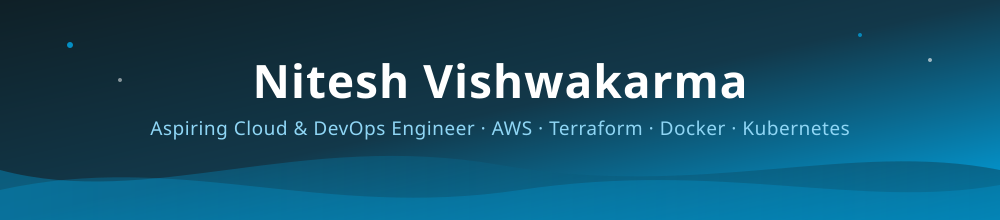

<div align="center">



<br>


<br>

<a href="https://linkedin.com/in/nitesh1vishwakarma">

</a>
<a href="https://portfolio-frontend-woss.vercel.app/">

</a>
<a href="mailto:niteshvishwakarma8574@gmail.com">

</a>
<a href="https://github.com/NiteshVishwakarma219">

</a>
<br>

<br>


</div>


<table width="100%">
<tr>
<td width="65%" valign="top">

## 👋 Hi, I'm Nitesh Vishwakarma

### Cloud & Security Engineer | AWS | Terraform | Linux | Docker

I build and document **production-style cloud infrastructure, cloud security environments, and Linux-based operational systems** using AWS and modern infrastructure tools.

My approach goes beyond simply deploying infrastructure. I focus on understanding how systems are **designed, secured, monitored, automated, troubleshot, and operated**.

</td>
<td width="35%" align="center">


</td>
</tr>
</table>

```yaml
role: "Cloud & Security Engineer"
education: "BCA — Cloud & Security"
primary_focus:
  - AWS Cloud
  - Cloud Security
  - Cybersecurity Fundamentals
  - Linux Administration
  - Infrastructure as Code
  - System Operations

core_stack:
  cloud: AWS
  infrastructure_as_code: Terraform
  operating_system: Linux
  containers: Docker
  scripting: Bash + Python
  version_control: Git + GitHub

supporting_skills:
  - Networking
  - IAM
  - Security Groups
  - Monitoring
  - Logging
  - Troubleshooting
  - Automation
  - CI/CD fundamentals

career_targets:
  - Cloud Engineer
  - Cloud Support Engineer
  - Cloud Security Engineer
  - Cybersecurity Analyst
  - SOC Analyst
  - System Engineer
  - Linux Administrator
  - IT Support
  - NOC / IT Operations

philosophy: "Learn → Build → Secure → Deploy → Troubleshoot → Improve"
```


## 🧠 What I Work On

- ☁️ **Cloud Infrastructure** — designing and deploying AWS environments with networking, compute, databases, IAM and monitoring.
- 🔐 **Cloud Security** — IAM, network security, access control, security hardening and security-focused AWS architecture.
- 🛡️ **Cybersecurity Fundamentals** — security monitoring, Linux security, logs, network analysis and incident-oriented troubleshooting.
- 🐧 **Linux Administration** — system management, users, permissions, SSH, services, networking, logs and troubleshooting.
- 🏗️ **Infrastructure as Code** — provisioning repeatable AWS infrastructure using Terraform modules and reusable configurations.
- 🐳 **Containerization** — Docker-based application deployment and container troubleshooting.
- ⚙️ **Automation** — Bash/Python automation and infrastructure operational workflows.
- 🔄 **DevOps Fundamentals** — Git, GitHub Actions, CI/CD concepts and deployment automation.


## 🛠️ Technical Skills

<div align="center">

**☁️ Cloud & Infrastructure**


<br><br>

**🐳 Containers & DevOps**


<br><br>

**🔐 Security & Operations**


<br><br>

**💻 Development & Databases**


<br><br>

**🧰 Tools**


</div>

<br>

| Category | Skills |
|---|---|
| **Cloud** | AWS, EC2, VPC, S3, IAM, RDS, CloudWatch, Route 53, ACM, ALB, SNS, SSM |
| **Infrastructure** | Terraform, Terraform Modules, Variables, Outputs, Locals, Remote State |
| **Networking** | VPC, Subnets, Route Tables, Internet Gateway, NAT Gateway, Security Groups, Network ACLs, DNS |
| **Security** | IAM, Least Privilege, Security Groups, Linux Security, Network Security, Security Monitoring |
| **Linux** | Linux Administration, SSH, Systemd, Users, Groups, Permissions, Processes, Services, Logs, Package Management |
| **Containers** | Docker, Docker Compose, Container Networking, Image Management |
| **DevOps** | Git, GitHub, GitHub Actions, CI/CD Fundamentals, Deployment Automation |
| **Scripting** | Python, Bash, Shell Automation |
| **Databases** | PostgreSQL, MySQL, MongoDB |
| **Web** | HTML, CSS, JavaScript, React, Node.js |
| **Troubleshooting** | Linux, AWS, Networking, Docker, Application, Infrastructure |


## 🚀 Featured Projects

### 01 — Enterprise AWS Cloud Infrastructure with Terraform

<a href="https://github.com/NiteshVishwakarma219/enterprise-aws-terraform-infrastructure">

</a>

Production-style AWS infrastructure provisioned and managed using Terraform.

```
AWS
 ├── VPC
 │   ├── Public Subnets
 │   └── Private Subnets
 │
 ├── Networking
 │   ├── Internet Gateway
 │   ├── NAT Gateway
 │   ├── Route Tables
 │   └── Security Groups
 │
 ├── Compute
 │   ├── EC2
 │   ├── Launch Template
 │   └── Auto Scaling
 │
 ├── Load Balancing
 │   └── Application Load Balancer
 │
 ├── Database
 │   └── RDS PostgreSQL
 │
 ├── Security
 │   ├── IAM
 │   ├── ACM
 │   └── SSM
 │
 └── Operations
     ├── CloudWatch
     ├── SNS
     └── Route 53
```

**Key Technologies**

`AWS` `Terraform` `VPC` `EC2` `ALB` `ASG` `RDS PostgreSQL` `IAM` `S3` `CloudWatch` `SNS` `SSM` `Route 53` `ACM` `Linux`

**What this project demonstrates**

- Infrastructure as Code using Terraform
- Secure AWS networking architecture
- Public/private subnet design
- Load-balanced application deployment
- Auto Scaling architecture
- Managed PostgreSQL database
- IAM and access management
- Cloud monitoring and alerting
- AWS Systems Manager operations
- Infrastructure troubleshooting
- Production-style documentation

---

### 02 — Enterprise AWS Cloud Security Platform

<a href="https://github.com/NiteshVishwakarma219/enterprise-aws-cloud-security-platform">

</a>

Cloud security-focused AWS platform designed to demonstrate practical security controls, monitoring and defensive architecture.

```
AWS Cloud Security
        │
        ├── Identity & Access
        │      └── IAM
        │
        ├── Network Security
        │      ├── VPC
        │      ├── Security Groups
        │      └── Network Controls
        │
        ├── Security Monitoring
        │      └── Cloud Security Visibility
        │
        ├── Infrastructure Protection
        │      └── Secure AWS Resources
        │
        └── Operations
               ├── Logging
               ├── Monitoring
               └── Incident-oriented Troubleshooting
```

**Focus Areas**

`AWS Security` `IAM` `Cloud Security` `Network Security` `Linux Security` `Monitoring` `Logging` `Security Hardening` `Incident Response Fundamentals`

**What this project demonstrates**

- AWS security architecture
- Identity and access management
- Cloud security controls
- Network security concepts
- Security monitoring
- Security hardening
- Operational visibility
- Troubleshooting security-related issues
- Practical cloud security documentation

---

### 03 — Enterprise Linux Administration & Security

<a href="https://github.com/NiteshVishwakarma219/enterprise-linux-administration-security">

</a>

Linux administration and security environment focused on system operations, hardening, troubleshooting and automation.

```
Linux Operations
       │
       ├── System Administration
       │      ├── Users
       │      ├── Groups
       │      ├── Permissions
       │      └── Processes
       │
       ├── Security
       │      ├── SSH
       │      ├── Hardening
       │      ├── Access Control
       │      └── Security Auditing
       │
       ├── Operations
       │      ├── Systemd
       │      ├── Services
       │      ├── Logs
       │      └── Networking
       │
       └── Automation
              ├── Bash
              └── Python
```

**Focus Areas**

`Linux` `Bash` `Python` `SSH` `Systemd` `Permissions` `Users & Groups` `Networking` `Security Hardening` `Logs` `Troubleshooting` `Automation`

**What this project demonstrates**

- Linux system administration
- User and permission management
- SSH administration
- Service management
- Linux security hardening
- Log analysis
- System troubleshooting
- Network troubleshooting
- Bash automation
- Python automation
- Operational documentation


## 🏆 Portfolio Architecture

<div align="center">

```
                    ┌─────────────────────────────┐
                    │   Enterprise HR Platform     │
                    │            EEMS              │
                    └──────────────┬──────────────┘
                                   │
                 ┌─────────────────┼─────────────────┐
                 │                 │                 │
                 ▼                 ▼                 ▼
        ┌────────────────┐ ┌────────────────┐ ┌────────────────┐
        │ AWS Terraform  │ │ AWS Cloud      │ │ Linux Admin    │
        │ Infrastructure │ │ Security       │ │ & Security     │
        └────────────────┘ └────────────────┘ └────────────────┘
                 │                 │                 │
                 ▼                 ▼                 ▼
              CLOUD           SECURITY           OPERATIONS
                 │                 │                 │
                 └─────────────────┼─────────────────┘
                                   ▼
                         CLOUD & SECURITY
                              ENGINEERING
```

</div>

### 🎯 Three Projects — One Career Direction

| Project | Primary Area | Supporting Areas |
|---|---|---|
| Enterprise AWS Cloud Infrastructure with Terraform | ☁️ Cloud Engineering | Terraform, Networking, Linux, DevOps |
| Enterprise AWS Cloud Security Platform | 🔐 Cloud Security | AWS, IAM, Networking, Monitoring |
| Enterprise Linux Administration & Security | 🐧 Linux & Security | Bash, Python, System Administration |


## 📊 What I'm Building

<div align="center">


<br><br>


<br><br>


</div>

### 📈 Contribution Activity

<div align="center">


</div>


## 🎯 Current Focus

<div align="center">


</div>

<br>

```
Cloud
  ↓
Secure
  ↓
Automate
  ↓
Monitor
  ↓
Troubleshoot
  ↓
Improve
```


## 💼 Open to Opportunities

I'm actively looking for entry-level opportunities in:

- Cloud Engineer
- Cloud Support Engineer
- Cloud Security
- Cybersecurity / SOC Analyst
- System Engineer
- Linux Administrator
- IT Support
- NOC / IT Operations
- Infrastructure Support
- Associate Cloud / Security Roles

My strongest career direction is:

**Cloud + Security + Linux + Infrastructure**

with DevOps and automation skills supporting the core profile.


## 📫 Connect With Me

<div align="center">

<a href="https://linkedin.com/in/nitesh1vishwakarma">

</a>
<a href="https://portfolio-frontend-woss.vercel.app/">

</a>
<a href="mailto:niteshvishwakarma8574@gmail.com">

</a>
<a href="https://github.com/NiteshVishwakarma219">

</a>

</div>

<br>

<div align="center">

⚡ **Learn → Build → Secure → Deploy → Troubleshoot → Improve**

<br>


</div>
